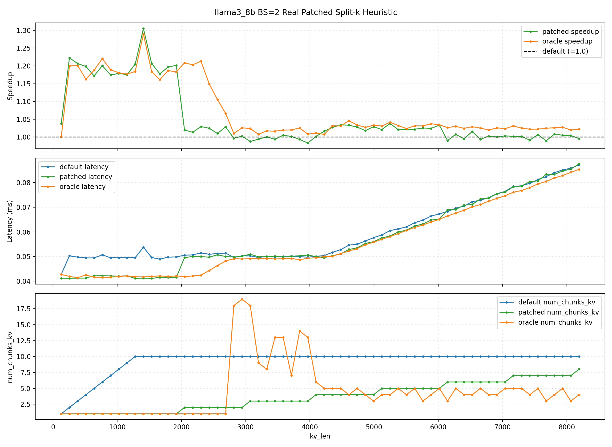
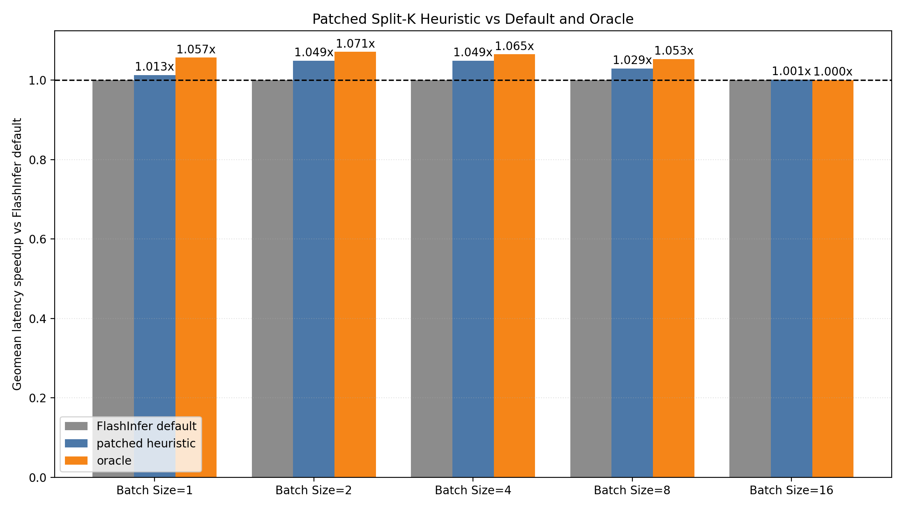

# Part 7. Proposed Split-K Selection

## 발표 구성

```text
대상        교수 및 전공 학생
발표 시간   약 2분 30초
장표 수     5장
주장 범위   Oracle 분석은 split-K와 MMA tile의 최적 후보를 사용하고,
            실제 패치 결과에서 split-K selector 효과를 제시
```

앞 발표 파트에서 `decode`는 tile 변경보다 split-K 설정의 영향을 크게 받으며,
FlashInfer 기본 설정이 작은 batch에서 과도한 split을 만들 수 있다는 관찰을 전달한 뒤
이어지는 파트입니다.

도입 연결 멘트:

> 앞에서 확인했듯 decode에서는 tile 크기보다 split-K 선택이 더 큰 영향을 주었습니다.
> 그래서 저는 FlashInfer가 split 수를 어떻게 결정하는지 분석하고,
> 그 결정을 가볍게 보정하는 방법을 적용했습니다.

---

## Slide 1. How FlashInfer Selects Split-K

### 이미지 / 캡션

> **[도식 삽입]** `Decode Wrapper -> FA2 Scheduler -> Split-K Chunks` 호출 흐름과,  
> `BS=2, KV=8192`에서 FlashInfer default가 `10 chunks/request`를 선택해  
> 목표 동시 실행 block 수에 가깝게 작업을 생성하는 모습을 함께 표시.

### 화면 문구

**FlashInfer chooses split-K to fill GPU parallelism**

```text
Tensor-core decode wrapper
  -> FA2 batch prefill scheduler
  -> split-K determined during plan()
```

```text
GPU 목표 동시 실행 block 수
  = 2 blocks/SM x 82 SMs
  = 164 blocks

목표 분할 작업 수
  = floor(164 blocks / 8 KV heads)
  = 20개
```

| Condition | FlashInfer Default |
|---|---:|
| `BS=2`, `KV length=8192` | `10 chunks/request` |
| 분할 작업 수 | `2 requests x 10 chunks = 20` |
| 실제 kernel blocks | `20개 x 8 KV heads = 160 blocks` |

**Observation:** The default policy targets occupancy, not measured latency.

### Scheduler 로직 요약

```text
목표 동시 실행 block 수 = 2 x SM 수 = 164
목표 분할 작업 수 = 목표 동시 실행 block 수 / KV head 수 = 20

# 이진탐색: 목표 분할 작업 수를 넘지 않는 가장 작은 chunk 크기 탐색
while (low < high) {
  chunk_size = (low + high) / 2;
  분할 작업 수 = sum_i(
      num_q_tiles[i] * ceil(kv_len[i] / chunk_size)
  );
  if (분할 작업 수 > 목표 분할 작업 수)
    low = chunk_size + 1;   // chunks are too small: reduce splitting
  else
    high = chunk_size;      // feasible: try more splitting
}
```

Decode 실험 조건에서는 request당 query tile이 하나이므로:

```text
분할 작업 수 = batch_size x request당 chunk 수
```

### 시각 구성

- 왼쪽: 호출 흐름을 세 박스로 표현한다.
  `Decode Wrapper` -> `FA2 Scheduler` -> `Split-K Chunks`
- 중앙: `164개 동시 실행 blocks -> 20개 분할 작업` 계산식을 표시한다.
- 오른쪽: binary search가 “목표 동시 실행 block 수를 넘지 않는 가장 작은 chunk”를 고른다는
  축약 pseudocode와 `BS=2` 예시를 표시한다.
- `10 chunks/request`는 주황색 또는 강조색으로 표시한다.

### 발표 대본 (약 35초)

> Tensor Core를 사용하는 decode wrapper는 내부적으로 일반 decode 커널이 아니라
> FA2 batch prefill scheduler 경로를 사용합니다.
> 이 scheduler는 latency 모델을 사용하지 않고, GPU 병렬성을 충분히 채우는 방향으로
> KV cache를 여러 chunk로 나눕니다.
> CUDA에서 block, 즉 CTA는 SM에 스케줄되어 실행되는 작업 단위입니다.
> 코드에서는 SM당 block을 2개씩 동시에 실행할 수 있다고 가정하므로,
> RTX 3090의 82개 SM에서 목표 동시 실행 block 수는 164개입니다.
> 커널이 KV head 8개 방향으로 전개되기 때문에, split 선택 관점에서는
> `164 / 8`, 즉 20개의 분할 작업을 목표로 삼습니다.
> 그리고 이진탐색으로 이 목표 작업 수를 넘지 않는 범위에서 가장 작은 KV chunk size를 찾습니다.
> chunk가 작을수록 split 수와 병렬 작업은 늘어나므로, 결과적으로 동시 실행 가능한 block 수를
> 최대한 채우는 선택입니다.
> 예를 들어 batch size 2, KV length 8192에서는 요청당 10개 chunk,
> 총 20개의 분할 작업, 실제 kernel 실행에서는 160개의 block을 생성합니다.
> 문제는 이 방식이 GPU 활용률은 높이지만, 항상 최소 latency를 보장하지는 않는다는 점입니다.

### 근거

- `flashinfer/flashinfer/decode.py`: tensor-core decode가 batch prefill module의 `plan()` 호출.
- `flashinfer/include/flashinfer/attention/scheduler.cuh`: `num_blocks_per_sm=2`,
  `max_batch_size_if_split = max_grid_size / num_kv_heads`.
- 실험 CSV의 `BS=2`, `KV=8192`, default row: `num_chunks_kv=10`.

---

## Slide 2. Oracle Split-K Reveals a Saturation Knee

### 이미지 / 캡션

> **[신규 그래프 삽입]** 각 KV length에서 측정된 `split-K x NUM_MMA_KV` 후보 중
> 가장 빠른 설정을 고른 oracle의 speedup/latency를 `BS=1,2,4,8,16`별로 비교한다.  
> 캡션: *The latency knee shifts with batch size, indicating a fixed total-work saturation region.*

### 그래프 구성

- 원본은 아래 5개 diagnostic oracle 결과 그림을 사용한다.
  - `../decode_tensor_core_experiment/results/plots/split_k_chunks/llama3_8b_bs1_oracle_splitk_chunks.png`
  - `../decode_tensor_core_experiment/results/plots/split_k_chunks/llama3_8b_bs2_oracle_splitk_chunks.png`
  - `../decode_tensor_core_experiment/results/plots/split_k_chunks/llama3_8b_bs4_oracle_splitk_chunks.png`
  - `../decode_tensor_core_experiment/results/plots/split_k_chunks/llama3_8b_bs8_oracle_splitk_chunks.png`
  - `../decode_tensor_core_experiment/results/plots/split_k_chunks/llama3_8b_bs16_oracle_splitk_chunks.png`
- 각 원본의 상단 `speedup`과 `latency` 패널만 잘라, 한 페이지에
  `5 rows x 2 columns` small multiples로 배치한다.
- 왼쪽 열: batch별 `Oracle configuration speedup vs FlashInfer default`.
- 오른쪽 열: batch별 `FlashInfer default latency`와 `Oracle configuration latency`.
- 각 latency 그래프에 knee 위치를 세로 점선 또는 라벨로 표시한다.
- 원본의 `CTA_TILE_KV`와 `num_chunks_kv` 패널은 이 장표에서는 제외하고,
  질의 대응 또는 보조 장표에서 configuration 선택이 달라졌음을 보여줄 때 사용한다.

```text
Approximate latency knee:
BS=1  -> KV ~= 8192 or beyond the measured range
BS=2  -> KV ~= 4096
BS=4  -> KV ~= 2048
BS=8  -> KV ~= 1024
BS=16 -> KV ~=  512

batch_size x kv_len ~= 8192 tokens
```

### 화면 문구

**Best observed decode configuration reveals a saturation knee**

```text
Before the knee:
  Better tiling/splitting can absorb more KV work using available parallel capacity.

After the knee:
  Even the oracle configuration cannot hide additional work, so latency grows.
```

```text
Key observation:
The knee shifts left as batch size doubles.
```

### 발표 대본 (약 30초)

> 앞선 실험에서 측정한 split-K와 MMA tile 설정 중, 각 KV length마다 가장 빠른 설정을
> 선택한 oracle 결과를 batch별로 비교해보면,
> 공통적인 latency 패턴이 나타납니다.
> 초기 구간에서는 KV length가 늘어나도 latency가 거의 일정한데,
> 이는 적절한 tiling과 split-K를 통해 남아 있는 병렬 실행 여유를 활용할 수 있음을 시사합니다.
> 하지만 어느 시점부터는 latency가 선형적으로 증가합니다.
> 특히 batch size가 두 배가 될 때 이 증가가 시작되는 KV length는 대략 절반으로 이동합니다.
> 즉 이 환경에서는 `batch size x KV length`가 약 일정한 지점에서
> 병렬 처리 여유가 소진되는 saturation knee가 나타납니다.
> 그리고 oracle speedup이 존재한다는 것은, FlashInfer default decode 설정이
> 이 구간에서 항상 latency-optimal하지는 않다는 것을 보여줍니다.

### 주장 범위

- 말해도 되는 주장:
  - split-K와 MMA tile 설정을 조절하면 saturation 이전/주변 구간에서 default보다 빠른 설정이 존재한다.
  - batch가 증가할수록 latency knee가 짧은 KV length 쪽으로 이동한다.
  - 기존 default decode 설정이 모든 구간의 최소 latency를 고르지는 못한다.
- 피할 주장:
  - “FlashInfer는 GPU를 활용하지 못한다.”
  - “Oracle 이전 구간은 GPU utilization이 낮다고 직접 측정됐다.”

위 표현을 피하는 이유:

```text
latency 곡선은 병렬 실행 여유와 saturation을 시사하지만,
실제 SM utilization 자체는 profiler metric으로 직접 측정한 값이 아니다.
```

### 데이터 사용 주의

- 이 장표는 `NUM_MMA_KV auto/1/2`와 `split-K`를 함께 탐색한 diagnostic oracle이다.
- 따라서 이 장표만으로 개선 원인을 split-K 하나로 단정하지 않는다.
- 다음 장의 제안 heuristic과 실제 패치 결과에서는 scheduler에서 변경한 항목이
  split-K 선택 로직이라는 점을 분명히 말한다.

---

## Slide 3. Proposed Heuristic: Prevent Over-Splitting

### 이미지 / 캡션

> **[도식 삽입]** FlashInfer default의 `10 chunks`를 Proposed Selector가 `8 chunks`로 줄이는 비교 그림.  
> 캡션: *Preserving parallelism while reducing merge overhead from over-splitting.*

### 화면 문구

**Keep parallelism, but guarantee enough work per chunk**

```text
proposed_chunks =
  min(default_chunks,
      floor(kv_len / (alpha x CTA_TILE_KV)),
      floor(beta / batch_size))
```

```text
alpha = 16, beta = 16, CTA_TILE_KV = 64
```

| `BS=2`, `KV=8192` | Value |
|---|---:|
| FlashInfer default | `10 chunks` |
| Work cap: `8192 / (16 x 64)` | `8 chunks` |
| Batch cap: `16 / 2` | `8 chunks` |
| **Proposed Selector** | **`8 chunks`** |

### 시각 구성

- 상단: 제안 수식을 한 줄로 크게 배치한다.
- 하단: `Default: 10 chunks` -> `Proposed: 8 chunks` 형태의 before/after 도식을 둔다.
- 각 chunk 아래에 `merge overhead`가 발생한다는 작은 표기를 두고,
  과도한 분할을 줄인다는 직관을 보여준다.

### 발표 대본 (약 30초)

> 저희의 제안은 기존 정책을 완전히 대체하는 복잡한 모델이 아니라,
> over-splitting만 방지하는 간단한 guard입니다.
> 첫 번째 제한은 chunk 하나가 최소한 `alpha` 배의 KV tile work를 갖도록 하는 것입니다.
> 두 번째 제한은 batch size가 이미 충분히 크면 추가 split을 줄이는 것입니다.
> 같은 batch 2, KV length 8192 예시에서 FlashInfer는 10개 chunk를 선택하지만,
> 저희 규칙은 work cap과 batch cap 모두 8을 반환해서 8개만 사용합니다.
> 즉 병렬성은 남기면서, 너무 작은 partial attention과 그 뒤의 merge overhead를 줄입니다.

### 발표 시 주의

- `CTA_TILE_KV=64`는 이번 실험에서 실제 관측된 `NUM_MMA_KV auto` 커널 값이다.
- 이 장표에서는 범용 최적값이라고 주장하지 않고, 실험 조건에서 사용한 selector를 설명한다.

---

## Slide 4. Detailed Behavior at Batch Size 2

### 사용할 그림



> **Figure.** `BS=2`에서 실제 패치된 selector는 default의 최대 `10` split-K chunks를 `8`로 제한하며,  
> 짧은~중간 KV length 구간에서 latency를 줄이고 oracle에 근접한 speedup을 보인다.

발표용 그래프를 다시 생성할 때는:

```bash
python compare_patched_results.py --model llama3_8b
```

### 화면 옆 보조 문구

**Batch Size 2: fewer splits reduce latency**

```text
Default:  up to 10 Split-K chunks
Proposed: up to 8 Split-K chunks
Result:   up to 1.305x point-wise speedup
```

```text
Improvement is strongest in short-to-mid KV lengths.
For very long KV lengths, the benefit becomes smaller.
```

### 발표 대본 (약 25초)

> 이 그래프는 simulation이 아니라, FlashInfer scheduler를 실제로 패치한 뒤
> split-auto 경로를 다시 실행한 결과입니다.
> 아래 그래프를 보면 default는 긴 구간에서 요청당 10개의 split-K chunk를 유지하지만,
> 제안 selector는 최대 8개로 제한합니다.
> 그 결과 위쪽 speedup 그래프에서 짧은 구간과 중간 KV length에서
> oracle에 가까운 개선이 나타나며, 특정 점에서는 약 1.305배까지 빨라졌습니다.
> 반면 KV가 충분히 길어지면 각 chunk의 일 자체가 많아지므로,
> split을 줄이는 효과는 상대적으로 작아집니다.

### 강조 포인트

- 이 장표의 `Oracle`은 실제 heuristic의 목표 상한선이라기보다,
  비교를 위한 split-K-only reference이다.
- 앞선 diagnostic oracle 장표는 MMA tile까지 함께 탐색한 결과이고,
  이 실제 패치 장표는 split-K selector 변경 결과이므로 역할이 다르다.

---

## Slide 5. Real Patched Result Across Batch Sizes

### 사용할 그림



> **Figure.** 실제 FlashInfer scheduler 패치 결과, Proposed Selector는 `BS=2,4`에서 약 `4.9%`,  
> `BS=8`에서 약 `2.9%`의 geomean latency 개선을 달성하며, `BS=16`은 추가 개선 여지가 거의 없다.

### 화면 문구

**Measured improvement after patching FlashInfer scheduler**

| Batch Size | Proposed Selector | Oracle | Interpretation |
|---:|---:|---:|---|
| 1 | `1.013x` | `1.057x` | Limited recovery |
| 2 | `1.049x` | `1.071x` | `+4.9%`, recovers most opportunity |
| 4 | `1.049x` | `1.065x` | `+4.9%`, recovers most opportunity |
| 8 | `1.029x` | `1.053x` | `+2.9%` |
| 16 | `1.001x` | `~1.000x` | No remaining opportunity |

하단 결론:

```text
Simple split-K guarding improves decode latency where default over-splits.
```

### 발표 대본 (약 25초)

> 전체 batch size 결과입니다.
> 제안 selector는 batch size 2와 4에서 geomean latency를 약 4.9퍼센트 개선했고,
> batch size 8에서도 약 2.9퍼센트의 개선을 보였습니다.
> 반면 batch size 16에서는 default가 이미 split을 거의 수행하지 않기 때문에,
> 애초에 개선할 여지가 없습니다.
> 따라서 이 결과는 무조건 split 수를 줄이라는 의미가 아니라,
> 작은 batch에서 default의 occupancy 중심 선택이 over-splitting을 만드는 경우에
> 제한 규칙이 효과적이라는 것을 보여줍니다.

---

## Transition To Limitation & Future Work

마무리 멘트:

> 결론적으로 기존 scheduler의 utilization 지향 정책은 작은 batch에서
> over-splitting을 만들 수 있었고, 최소 chunk work를 보장하는 heuristic으로
> 실제 latency를 줄일 수 있었습니다.
> 다만 현재 규칙은 RTX 3090과 Llama3-8B 조건에서 도출했기 때문에,
> 다음으로는 GPU와 모델에 따른 일반화가 필요합니다.

---

## 발표용 데이터와 그림 선택 기준

### 사용

- `results/plots/llama3_8b_bs2_real_patched_detail.png`
- `results/plots/llama3_8b_real_patched_vs_default_oracle_geomean.png`
- `results/data/llama3_8b_real_patched_comparison_summary.csv`

### 실제 패치 결과의 근거 그림으로는 제외

- `../decode_tensor_core_experiment/results/plots/split_k_chunks/llama3_8b_bs2_oracle_splitk_chunks.png`

제외 이유:

```text
해당 oracle은 split-K뿐 아니라 NUM_MMA_KV auto/1/2까지 함께 선택한다.
따라서 실제 selector-only 패치 결과의 근거 그림으로는 사용하지 않는다.
다만 Slide 2의 diagnostic oracle 분석 그림으로는 사용할 수 있다.
```

## 예상 질문 대응

| 질문 | 답변 |
|---|---|
| 왜 `alpha=16`, `beta=16`인가? | 기존 sweep 결과로 후보를 시뮬레이션한 뒤 실제 패치 재측정에 사용한 설정이다. 이번 발표에서는 유효성을 보인 실험 설정으로 제시하며, 일반화는 future work로 남긴다. |
| 왜 tile까지 함께 최적화하지 않았나? | 이번 파트는 split-K selector 효과만 분리해 검증하기 위해 `NUM_MMA_KV auto`를 고정했다. |
| Oracle보다 왜 낮은가? | Oracle은 각 KV length에서 사후적으로 최적 split을 고르는 상한선이고, 제안 방식은 런타임에 적용 가능한 단순 규칙이다. |
| BS=16에서 patched가 oracle보다 근소하게 높은 이유는? | 실질적으로 개선 여지가 없는 구간의 측정 흔들림이다. 의미 있는 우위로 해석하지 않는다. |
